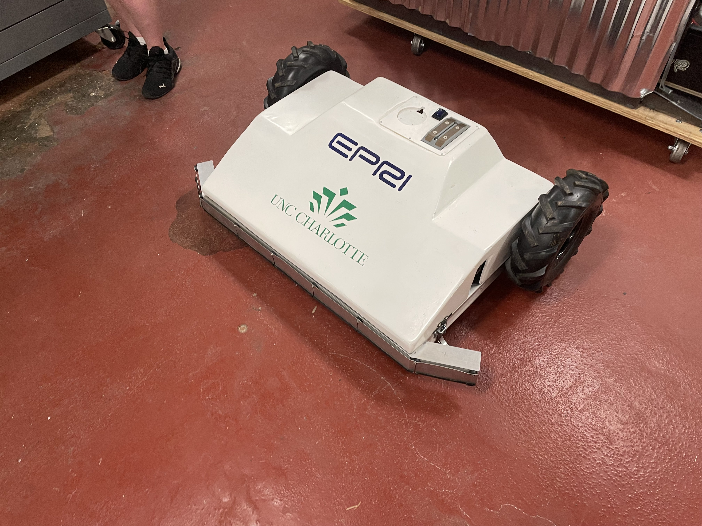
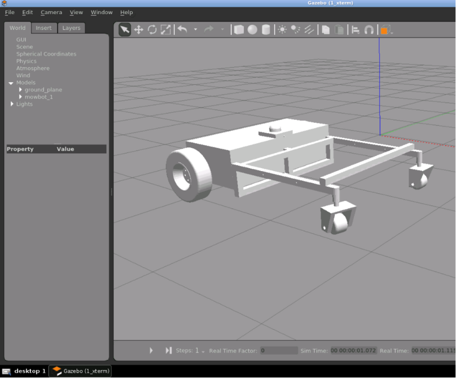

# **A Better Approach to Vegetation Management at Utility-Scale PV Plant**

This project is the six-phase "A Better Approach to Vegetation Management at Utility-Scale PV Plant" project. 
This phase aims to improve the functionality and autonomy of the existing five-year-old MowBot by developing a new model while testing the new functionality of the current model.

The MowBot will cut vegetation surrounding photovoltaic equipment at solar power facilities. 
Excess vegetation can decrease the energy efficiency of the solar panels due to sunlight blockages around the bottom of the solar panels, so the vegetation must be effectively maintained.
The Mowbot will autonomously trim excess vegetation, navigate the photovoltaic facility, and return to its charging station.

## Team Members
- Cassidy Holene (Mechanical Engineer)
- Dejan Rasuo (Electrical Engineer)
- Erwin Castro (Computer Engineer)
- Jonathon Nguyen (Computer Engineer)
- Joseph Palomo (Mechanical Engineer)
- Patrick Lichtenwalner (Mechanical Engineer)
- Trevor Buchanan (Electrical Engineer)

## Project Overview
### The Mowbot will go through a new **redesign** of the physical design. 
- The existing vegetation management solutions are not as efficient, cost-effective, or do not protect the equipment of the solar farms. Some current solutions are livestock grazing with goats or sheep and manual mechanical mowing.
- The Mowbot should not damage the PV equipment or modify the environment.
- The new design will be a scaled up version of the current design. This includes making the cutting area bigger. The cut-area per charge will be increased.

  

Figure 1: The current mowbot prototype.

  

Figure 2: The new upscale Mowbot design.

### The Mowbot will gain new features to improve the autonomous functionality.
- The new features include: computer-vision-based object detection, Accelerometer, and Re-charging algorithm.
- The internal computer will be upgraded from a Raspberry PI to an Nvidia Jetson Nano.
- The computers will be used in parallel to split up the processing tasks.

### The Mowbot will be simulated using Gazebo and ROS.
- The idea is to simulated and test the robot with all the sensors before building it in real life
- That will help planning out the robot building process and minimize error.

  

Figure 3: One of the test CAD model in Gazebo.

## Computer Features
- [x] Controlling the relays for the blades and wheels motors.
- [x] Localization with GPS and RTK.
- [x] Turning on and off the blades motors.
- [x] Controlling the speed of the wheel motors.
- [x] Use the data from the wheel encoder.
- [x] Using LiDar for obstacle detection
- [x] Use bumpers to detect collision.
- [ ] Tracking the charge of the battery.
- [ ] Use computer vision for object detection.  [^1]
- [ ] Use a accelerometer to detect collision.  [^2]
- [ ] Use machine learning to detect obstacles.  [^1]

[^1]: These go hand and hand. Right now, this is very broad. As we go through paces of developing software, the feature definition will become narrow. 
[^2]: This will replace the bumpers. The bumpers are too sensitive.
